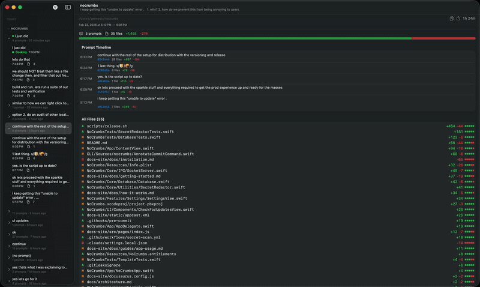

# 🥐 NoCrumbs

> Catch every crumb your agent leaves behind.

A local-first tool that links every file change your AI coding assistant makes back to the prompt that caused it. Native Mac app + fire-and-forget CLI. No cloud, no telemetry, no accounts.



## Quick Start

```bash
brew install --cask geneyoo/tap/nocrumbs
nocrumbs install
```

That's it. Use your AI coding assistant normally — prompts and file changes appear in NoCrumbs automatically.

Optionally, add commit annotations to a repo: `nocrumbs install-git-hooks`

**Requirements:** macOS 14+ &nbsp;|&nbsp; [Building from source →](https://geneyoo.github.io/nocrumbs/docs/getting-started#building-from-source)

---

## What It Does

| Feature | How |
|---------|-----|
| **Real-time tracking** | Captures every AI action as it happens — file writes, commands, commits — and links them back to the prompt that triggered them |
| **Side-by-side diff viewer** | Syntax-highlighted, Phabricator-style. Click a prompt, see what changed |
| **Commit message annotation** | Appends prompt history to commit messages automatically. Customizable templates |
| **Session export** | Copy session summary as markdown. Deep links back to NoCrumbs |
| **Git + Mercurial** | Detects VCS automatically |
| **Secret redaction** | API keys, tokens, and credentials are scrubbed from commit annotations automatically |

### Commit Annotation

Single prompt:
```
refactor: convert auth to async/await
---
🥐 refactor auth to async/await · 4 files · abc12345
```

Multiple prompts:
```
refactor: convert auth to async/await
---
🥐 3 prompts · 8 files · abc12345

1. refactor auth to async/await (3 files)
2. add error handling to the new async methods (3 files)
3. update tests for new async patterns (2 files)
```

Granular content toggles in Settings: prompt list, file counts, session ID, deep links — all independently configurable. Customizable via `nocrumbs template add/set/remove/preview`.

---

## Design Principles

**Seamless.** Install once, never think about it again. The CLI hook exits in <50ms, always exit 0, silent fail if app isn't running. Zero friction.

**Lightweight.** Don't store diffs — git already has them. Store only prompt-to-commit linkage. DB stays under 1MB for years of use. Sub-millisecond IPC via Unix domain socket.

**Local-first, always.** No network calls, no API keys, no accounts, no telemetry. Everything stays on your machine via Unix domain socket.

**Secure by default.** Secret redaction strips API keys, tokens, and credentials from commit annotations before they hit git history. Pre-commit hooks and CI scanning prevent accidental secret leaks in contributions.

**Capture intent, not noise.** Top-level user prompts only. Subagent activity, plan steps, todos — all discarded.

**Derive, don't duplicate.** Diffs computed on demand from git/hg. No diff blobs, no file snapshots.

---

## Architecture

```
AI Assistant ──PostToolUse hook──▶ nocrumbs CLI ──socket──▶ Mac App ──▶ SQLite
```

The CLI receives hook payloads as JSON, extracts metadata (session ID, prompt text, file paths), and forwards over a Unix domain socket. The Mac app stores prompt metadata locally and derives diffs from git on demand.

For full technical details: [`docs/architecture.md`](docs/architecture.md)

### Tech Stack

| Layer | Technology |
|-------|-----------|
| App | SwiftUI + AppKit hybrid, `@Observable` (Swift 5.9+) |
| Diff view | NSTextView (TextKit 1) via NSViewRepresentable |
| Syntax highlighting | Regex-based, 20+ languages, zero dependencies |
| Database | Raw SQLite3 C API, WAL mode |
| IPC | Unix domain socket (POSIX) |
| CLI | Swift Package Manager, zero dependencies |
| VCS | git/hg subprocess via Process |

### Storage

```
~/Library/Application Support/NoCrumbs/
├── nocrumbs.sqlite    ← sessions + prompt events + file changes
└── nocrumbs.sock      ← Unix domain socket (while app running)
```

No diff blobs, no file snapshots. Lean metadata sidecar only.

---

## CLI Commands

```
nocrumbs install              Configure Claude Code hooks (run once)
nocrumbs install-git-hooks    Install prepare-commit-msg hook (run per repo)
nocrumbs event                Pipe any hook event to app
nocrumbs annotate-commit      Annotate commit message (called by git hook)
nocrumbs describe             Pipe per-file change descriptions to app
nocrumbs rename-session       Rename a session
nocrumbs template             Manage commit annotation templates (add/list/set/remove/preview)
```

---

## Supported Tools

Currently supported:
- **[Claude Code](https://docs.anthropic.com/en/docs/claude-code)** — via hook events

Coming soon:
- **[Codex CLI](https://github.com/openai/codex)** — via hook events

---

## Keyboard Shortcuts

| Shortcut | Action |
|----------|--------|
| `⌘ D` | Show NoCrumbs window |
| `⌘ ,` | Settings |
| `⌘ Q` | Quit |
| `⌘ +` / `⌘ -` | Zoom in / out |
| `⌘ 0` | Reset zoom |
| `⌥ ←` / `⌥ →` | Collapse / expand session in sidebar |

---

## Contributing

```bash
# Set up the pre-commit secret scanning hook
git config core.hooksPath .githooks
```

The pre-commit hook runs [gitleaks](https://github.com/gitleaks/gitleaks) on staged changes to catch accidental secret commits. CI runs the same scan on all PRs.

---

## What NoCrumbs Is Not

- Not an inline editor diff (that's Cursor's job)
- Not a code review bot
- Not a cloud service
- Not an IDE plugin
